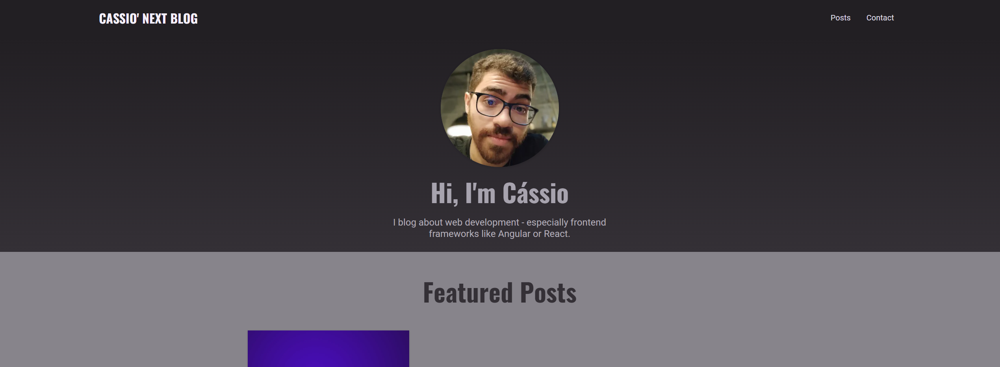

<p align="center">

  <h2 align="center">Nextjs Blog App</h2>

  <p align="center">
    A complete nextjs app!
    <br />
    <a href="https://nextjs-blog-app-livid.vercel.app/" target="_blank">Source</a>
    ·
    <a href="https://github.com/cassiorodp/nextjs_blog_app/issues" target="_blank">Report Bug</a>
  </p>
</p>

---

<p align="center">
  
</p>

---

<details open="open">
  <summary><h2">Table of Contents</h2></summary>
  <ol>
    <li>
      <a href="#about">About</a>
      <ul>
        <li><a href="#features">Features</a></li>
        <li><a href="#techs">Techs</a></li>
      </ul>
    </li>
    <li>
      <span>Running the App</span>
      <ul>
        <li><a href="#prerequisites">Prerequisites</a></li>
        <li><a href="#installation">Installation</a></li>
      </ul>
    </li>
    <li><a href="#contribution">Contribution</a></li>
    <li><a href="#contacts">Contacts</a></li>
  </ol>
</details>

<h2 id="about">⚡ About</h2> 
<p align="center">
Nextjs Blog app is an app that emulate a functional blog using all next js features!
</p>

<h3 id="features">⚙ Features</h3>

- API Routing
- Server Side Rendering
- Server Side data fetching with mongoDB connection

<h3 id="techs">💻 Techs</h3>
  
<div>
   
  
  
  

</div>

<h3>👨‍💻 Running the App</h3>

To execute the app, please follow this instructions.

<h3 id="prerequisites">Prerequisites</h3>

You need to have these tools: NPM & Git.
Besides, if you want to contribuite later, it's good to have some code editor like vsCode

<h3 id="installation">Installation</h3>

1. Clone the repository (HTTPS or SSH)

   ```sh
   git clone git@github.com:cassiorodp/nextjs_blog_app.git
   ```

   ```sh
   git@github.com:cassiorodp/nextjs_blog_app.git
   ```

2. Enter the app's folder and install the dependencies

   ```sh
   cd nextjs_blog_app
   npm install
   ```

   or

   ```sh
   cd nextjs_blog_app
   yarn
   ```

3. Run the app

   ```
    npm run dev
   ```

   or

   ```
   yarn dev
   ```

<h2 id="contribution">🏗 Contribution</h2>

Feel free to add any contribution on our app! Here is some instructions:

1. Fork
2. Create your feature/fix branch (`git checkout -b feature/fix`)
3. Commit your alterations (`git commit -m 'Improving your app!'`)
4. Push to remote repository (`git push origin feature/fix`)
5. Open a PR(Pull Request)

---

<h2 id="contacts">📫 Contacts</h2>
    
<h3>This project was done by the developer:</h3>
<ul>
    <li>
      <a href="https://github.com/cassiorodp" target="_blank">
        
      </a>
    </li>
</ul>

---

We are open for feedbacks.
